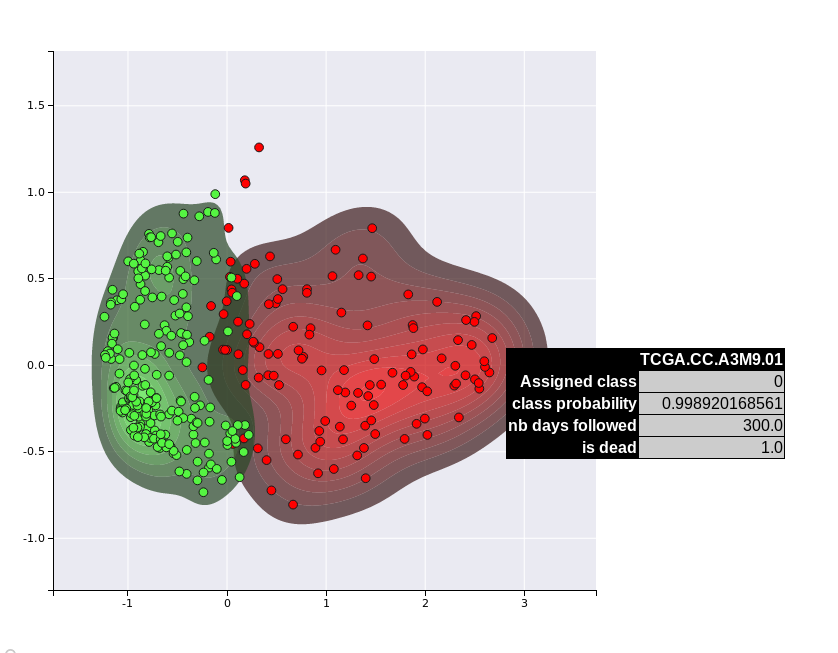
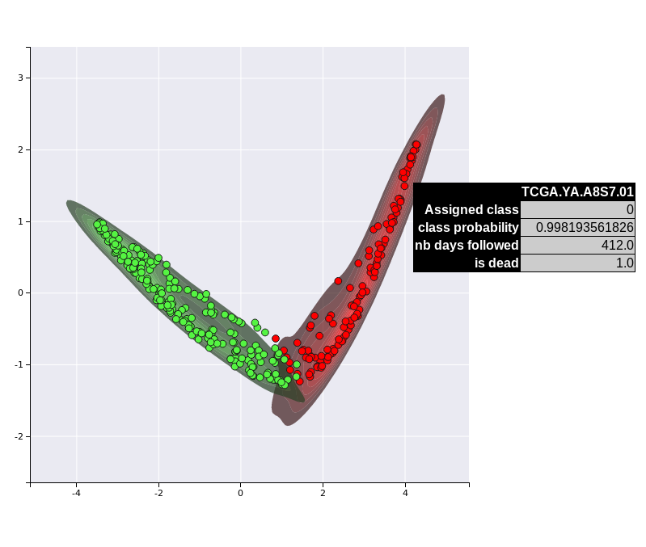

# Case study: Analyzing TCGA HCC dataset

In this example, we will use the RNA-Seq, miRNA, and DNA Methylation datsets from the TCGA HCC cancer dataset to perform subtype detection, identify subtype specific features, and fit supervised model that we will use to project the HCC samples using only the RNA-Seq OMIC layer. This real case dataset is available directly inside the `data` folder from the package.

## Dataset preparation

First, locate the data folder and the compressed matrices:

```bash
data
├── meth.tsv.gz
├── mir.tsv.gz
├── rna.tsv.gz
└── survival.tsv
```

go to that folder and extract these files using `gzip -d *.gz`. Now, we are ready to instanciate a DeepProg instance.

```python
from simdeep.simdeep_boosting import SimDeepBoosting
from simdeep.config import PATH_THIS_FILE

from collections import OrderedDict
from os.path import isfile

# specify your data path
#path_data = 

assert(isfile(path_data + "meth.tsv"))
assert(isfile(path_data + "rna.tsv"))
assert(isfile(path_data + "mir.tsv"))

tsv_files = OrderedDict([
    ('MIR', 'mir.tsv'),
    ('METH', 'meth.tsv'),
    ('RNA', 'rna.tsv'),
])

# The survival file located also in the same folder
survival_tsv = 'survival.tsv'

assert(isfile(path_data + "survival.tsv"))

# More attributes
PROJECT_NAME = 'HCC_dataset' # Name
EPOCHS = 10 # autoencoder fitting epoch
SEED = 10045 # random seed
nb_it = 10 # Number of submodels to be fitted
nb_threads = 2 # Number of python threads used to fit survival model
```

We need also to specify the columns to use from the survival file:

```bash
head data/survival.tsv

Samples days    event
TCGA.2V.A95S.01 0       0
TCGA.2Y.A9GS.01 724     1
TCGA.2Y.A9GT.01 1624    1
TCGA.2Y.A9GU.01 1939    0
TCGA.2Y.A9GV.01 2532    1
TCGA.2Y.A9GW.01 1271    1
TCGA.2Y.A9GX.01 2442    0
TCGA.2Y.A9GY.01 757     1
TCGA.2Y.A9GZ.01 848     1

```

```python
survival_flag = {
    'patient_id': 'Samples',
    'survival': 'days',
    'event': 'event'}
```

Now we define a ray instance to distribute the fitting of the submodels
```python

import ray
ray.init(webui_host='0.0.0.0', num_cpus=3)
```

## Model fitting

We are now ready to instanciate a DeepProg instance and to fit a model

```python
# Instanciate a DeepProg instance
boosting = SimDeepBoosting(
    nb_threads=nb_threads,
    nb_it=nb_it,
    split_n_fold=3,
    survival_tsv=survival_tsv,
    training_tsv=tsv_files,
    path_data=path_data,
    project_name=PROJECT_NAME,
    path_results=path_data,
    epochs=EPOCHS,
    survival_flag=survival_flag,
    distribute=True,
    seed=SEED)

boosting.fit()

# predict labels of the training

boosting.predict_labels_on_full_dataset()
boosting.compute_clusters_consistency_for_full_labels()
boosting.evalutate_cluster_performance()
boosting.collect_cindex_for_test_fold()
boosting.collect_cindex_for_full_dataset()

boosting.compute_feature_scores_per_cluster()
boosting.write_feature_score_per_cluster()
```

## Visualisation and analysis

We should obtain subtypes with very significant survival differences, as we can see in the results located in the results folder


Now we might want to project the training samples using only the RNA-Seq layer

```python
boosting.load_new_test_dataset(
    {'RNA': 'rna.tsv'},
    'test_RNA_only',
    survival_tsv,
)

boosting.predict_labels_on_test_dataset()
boosting.compute_c_indexes_for_test_dataset()
boosting.compute_clusters_consistency_for_test_labels()
```

We can use the visualisation functions to project our samples into a 2D space

```python
# Experimental method to plot the test dataset amongst the class kernel densities
boosting.plot_supervised_kernel_for_test_sets()
boosting.plot_supervised_predicted_labels_for_test_sets()
```
Results for unsupervised projection



Results for supervised projection


