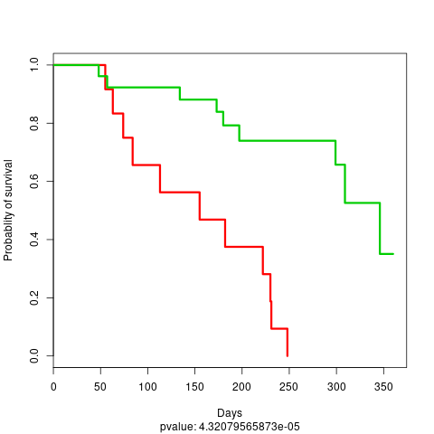
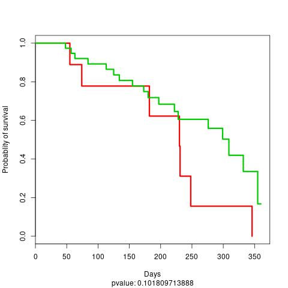

# Tutorial: Simple DeepProg model

The principle of DeepProg can be summarized as follow:
* Loading of multiple samples x OMIC matrices
* Preprocessing ,normalisation, and sub-sampling of the input matrices
* Matrix transformation using autoencoder
* Detection of survival features
* Survival feature agglomeration and clustering
* Creation of supervised models to predict the output of new samples

## Input parameters

All the default parameters are defined in the config file: `./simdeep/config.py` but can be passed dynamically. Three types of parameters must be defined:
  * The training dataset (omics + survival input files)
    * In addition, the parameters of the test set, i.e. the omic dataset and the survival file
  * The parameters of the autoencoder (the default parameters works but it might be fine-tuned.
  * The parameters of the classification procedures (default are still good)


## Input matrices

As examples, we included two datasets:
* A dummy example dataset in the `example/data/` folder:
```bash
examples
├── data
│   ├── meth_dummy.tsv
│   ├── mir_dummy.tsv
│   ├── rna_dummy.tsv
│   ├── rna_test_dummy.tsv
│   ├── survival_dummy.tsv
│   └── survival_test_dummy.tsv
```

* And a real dataset in the `data` folder. This dataset derives from the TCGA HCC cancer dataset. This dataset needs to be decompressed before processing:

```bash
data
├── meth.tsv.gz
├── mir.tsv.gz
├── rna.tsv.gz
└── survival.tsv

```

An input matrix file should follow this format:

```bash
head mir_dummy.tsv

Samples        dummy_mir_0     dummy_mir_1     dummy_mir_2     dummy_mir_3 ...
sample_test_0  0.469656032287  0.347987447237  0.706633335508  0.440068758445 ...
sample_test_1  0.0453108219657 0.0234642968791 0.593393816691  0.981872970341 ...
sample_test_2  0.908784043793  0.854397550009  0.575879144667  0.553333958713 ...
...

```

Also, if multiple matrices are used as input, they must keep the sample order. For example:

```bash
head rna_dummy.tsv

Samples        dummy_gene_0     dummy_gene_1     dummy_gene_2     dummy_gene_3 ...
sample_test_0  0.69656032287  0.47987447237  0.06633335508  0.40068758445 ...
sample_test_1  0.53108219657 0.234642968791 0.93393816691  0.81872970341 ...
sample_test_2  0.8784043793  0.54397550009  0.75879144667  0.53333958713 ...
...

```

The  arguments `training_tsv` and `path_data` from the `extract_data` module are used to defined the input matrices.

```python
# The keys/values of this dict represent the name of the omic and the corresponding input matrix
training_tsv = {
    'GE': 'rna_dummy.tsv',
    'MIR': 'mir_dummy.tsv',
    'METH': 'meth_dummy.tsv',
}
```

a survival file must have this format:

```bash
head survival_dummy.tsv

barcode        days recurrence
sample_test_0  134  1
sample_test_1  291  0
sample_test_2  125  1
sample_test_3  43   0
...

```

In addition, the fields corresponding to the patient IDs, the survival time, and the event should be defined using the `survival_flag` argument:

```python
#Default value
survival_flag = {'patient_id': 'barcode',
                  'survival': 'days',
                 'event': 'recurrence'}
```

## Creating a simple DeepProg model with one autoencoder for each omic

First, we will build a model using the example dataset from `./examples/data/` (These example files are set as default in the config.py file). We will use them to show how to construct a single DeepProg model inferring a autoencoder for each omic

```python

# SimDeep class can be used to build one model with one autoencoder for each omic
from simdeep.simdeep_analysis import SimDeep
from simdeep.extract_data import LoadData

help(SimDeep) # to see all the functions
help(LoadData) # to see all the functions related to loading datasets

# Defining training datasets
from simdeep.config import TRAINING_TSV
from simdeep.config import SURVIVAL_TSV
# Location of the input matrices and survival file
from simdeep.config import PATH_DATA

dataset = LoadData(training_tsv=TRAINING_TSV,
        survival_tsv=SURVIVAL_TSV,
        path_data=PATH_DATA)

# Defining the result path in which will be created an output folder
PATH_RESULTS = "./TEST_DUMMY/"

# instantiate the model with the dummy example training dataset defined in the config file
simDeep = SimDeep(
        dataset=dataset,
        path_results=PATH_RESULTS,
        path_to_save_model=PATH_RESULTS, # This result path can be used to save the autoencoder
        )

simDeep.load_training_dataset() # load the training dataset
simDeep.fit() # fit the model
```

At that point, the model is fitted and some output files are available in the output folder:

```bash
TEST_DUMMY
├── test_dummy_dataset_KM_plot_training_dataset.png
└── test_dummy_dataset_training_set_labels.tsv
```

The tsv file contains the label and the label probability for each sample:

```bash
sample_test_0   1       7.22678272919e-12
sample_test_1   1       4.48594196888e-09
sample_test_4   1       1.53363205571e-06
sample_test_5   1       6.72170409655e-08
sample_test_6   0       0.9996581662
sample_test_7   1       3.38139255666e-08
```

And we also have the visualisation of a Kaplan-Meier Curve:



Now we are ready to use a test dataset and to infer the class label for the test samples.
The test dataset do not need to have the same input omic matrices than the training dataset and not even the sample features for a given omic. However, it needs to have at least some features in common.

```python
# Defining test datasets
from simdeep.config import TEST_TSV
from simdeep.config import SURVIVAL_TSV_TEST

simDeep.load_new_test_dataset(
    TEST_TSV,
    fname_key='dummy',
    path_survival_file=SURVIVAL_TSV_TEST, # [OPTIONAL] test survival file useful to compute accuracy of test dataset

    )

# The test set is a dummy rna expression (generated randomly)
print(simDeep.dataset.test_tsv) # Defined in the config file
# The data type of the test set is also defined to match an existing type
print(simDeep.dataset.data_type) # Defined in the config file
simDeep.predict_labels_on_test_dataset() # Perform the classification analysis and label the set dataset

print(simDeep.test_labels)
print(simDeep.test_labels_proba)

```

The assigned class and class probabilities for the test samples are now available in the output folder:

```bash
TEST_DUMMY
├── test_dummy_dataset_dummy_KM_plot_test.png
├── test_dummy_dataset_dummy_test_labels.tsv
├── test_dummy_dataset_KM_plot_training_dataset.png
└── test_dummy_dataset_training_set_labels.tsv

head test_dummy_dataset_training_set_labels.tsv


```

And a KM plot is also constructed using the test labels



Finally, it is possible to save the keras model:

```python
simDeep.save_encoders('dummy_encoder.h5')
```
