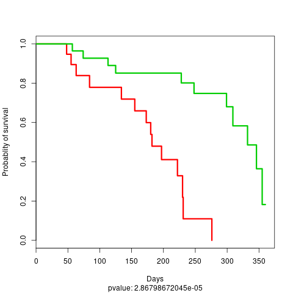
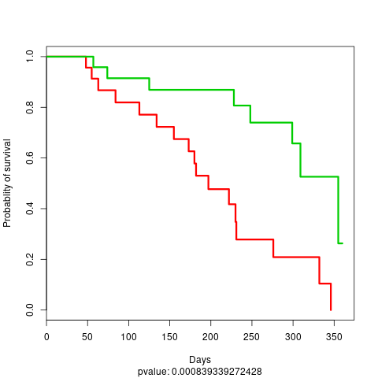
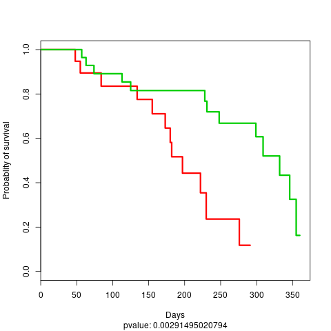

# Tutorial: Ensemble of DeepProg model

Secondly, we will build a more complex DeepProg model constituted of an ensemble of sub-models, each originated from a subset of the data. For that purpose, we need to use the `SimDeepBoosting` class:


```python
from simdeep.simdeep_boosting import SimDeepBoosting

help(SimDeepBoosting)
```

Similarly, to the SimDeep class, we define our training dataset

```python
# Location of the input matrices and survival file
from simdeep.config import PATH_DATA

from collections import OrderedDict

# Example tsv files
tsv_files = OrderedDict([
          ('MIR', 'mir_dummy.tsv'),
          ('METH', 'meth_dummy.tsv'),
          ('RNA', 'rna_dummy.tsv'),
])

# File with survival event
survival_tsv = 'survival_dummy.tsv'

```

## Instanciation

Then, we define arguments specific to DeepProg and instanciate an instance of the class

```python
project_name = 'stacked_TestProject'
epochs = 10 # Autoencoder epochs. Other hyperparameters can be fine-tuned. See the example files
seed = 3 # random seed used for reproducibility
nb_it = 5 # This is the number of models to be fitted using only a subset of the training data
nb_threads = 2 # These treads define the number of threads to be used to compute survival function
PATH_RESULTS = "./"

boosting = SimDeepBoosting(
    nb_threads=nb_threads,
    nb_it=nb_it,
    split_n_fold=3,
    survival_tsv=survival_tsv,
    training_tsv=tsv_files,
    path_data=PATH_DATA,
    project_name=project_name,
    path_results=PATH_RESULTS,
    epochs=epochs,
    seed=seed)
```
Here, we define a DeepProg model that will create 5 SimDeep instances each based on a subset of the original training dataset.the number of instance is defined by he `nb_it` argument. Other arguments related to the autoencoders construction can be defined during the class instanciation, such as `epochs`.

## Fitting
Once the model is defined we can fit it

```python
# Fit the model
boosting.fit()
# Predict and write the labels
boosting.predict_labels_on_full_dataset()
```

Some output files are generated in the output folder:

```bash
stacked_TestProject
├── stacked_TestProject_full_labels.tsv
├── stacked_TestProject_KM_plot_boosting_full.png
├── stacked_TestProject_proba_KM_plot_boosting_full.png
├── stacked_TestProject_test_fold_labels.tsv
└── stacked_TestProject_training_set_labels.tsv
```

The inferred labels, labels probability, survival time, and event are written in the `stacked_TestProject_full_labels.tsv` file:

```bash
sample_test_48  1       0.474781026865  332.0   1.0
sample_test_49  1       0.142554926379  120.0   0.0
sample_test_46  1       0.355333486034  355.0   1.0
sample_test_47  0       0.618825352398  48.0    1.0
sample_test_44  1       0.346797097671  179.0   0.0
sample_test_45  1       0.0254692404734 360.0   0.0
sample_test_42  1       0.441997226254  346.0   1.0
sample_test_43  1       0.0783603292911 335.0   0.0
sample_test_40  1       0.380182410315  149.0   0.0
sample_test_41  0       0.953659261728  155.0   1.0
```

Note that the label probablity corresponds to the probability to belongs to the subtype with the lowest survival rate.
Two KM plots are also generated, one using the cluster labels:



and one using the cluster label probability dichotomized:



We can also compute the feature importance per cluster:

```python
# oOmpute the feature importance
boosting.compute_feature_scores_per_cluster()
# Write the feature importance
boosting.write_feature_score_per_cluster()
```

The results are updated in the output folder:

```bash
stacked_TestProject
├── stacked_TestProject_features_anticorrelated_scores_per_clusters.tsv
├── stacked_TestProject_features_scores_per_clusters.tsv
├── stacked_TestProject_full_labels.tsv
├── stacked_TestProject_KM_plot_boosting_full.png
├── stacked_TestProject_proba_KM_plot_boosting_full.png
├── stacked_TestProject_test_fold_labels.tsv
└── stacked_TestProject_training_set_labels.tsv
```

## Evaluate the models

DeepProg allows to compute specific metrics relative to the ensemble of models:

```python
# Compute internal metrics
boosting.compute_clusters_consistency_for_full_labels()

# Collect c-index
boosting.compute_c_indexes_for_full_dataset()
# Evaluate cluster performance
boosting.evalutate_cluster_performance()
# Collect more c-indexes
boosting.collect_cindex_for_test_fold()
boosting.collect_cindex_for_full_dataset()
boosting.collect_cindex_for_training_dataset()

# See Ave. number of significant features per omic across OMIC models
boosting.collect_number_of_features_per_omic()

```

## Predicting on test dataset

We can then load and evaluate a first test dataset

```
boosting.load_new_test_dataset(
    {'RNA': 'rna_dummy.tsv'}, # OMIC file of the test set. It doesnt have to be the same as for training
    'survival_dummy.tsv', # Survival file of the test set
    'TEST_DATA_1', # Name of the test test to be used
)

# Predict the labels on the test dataset
boosting.predict_labels_on_test_dataset()
# Compute C-index
boosting.compute_c_indexes_for_test_dataset()
# See cluster consistency
boosting.compute_clusters_consistency_for_test_labels()
```

We can load an evaluate a second test dataset

```python
boosting.load_new_test_dataset(
    {'MIR': 'mir_dummy.tsv'}, # OMIC file of the test set. It doesnt have to be the same as for training
    'survival_dummy.tsv', # Survival file of the test set
    'TEST_DATA_2', # Name of the test test to be used
)

# Predict the labels on the test dataset
boosting.predict_labels_on_test_dataset()
# Compute C-index
boosting.compute_c_indexes_for_test_dataset()
# See cluster consistency
boosting.compute_clusters_consistency_for_test_labels()
```

The output folder is updated with the new output files

```bash
stacked_TestProject
├── stacked_TestProject_features_anticorrelated_scores_per_clusters.tsv
├── stacked_TestProject_features_scores_per_clusters.tsv
├── stacked_TestProject_full_labels.tsv
├── stacked_TestProject_KM_plot_boosting_full.png
├── stacked_TestProject_proba_KM_plot_boosting_full.png
├── stacked_TestProject_TEST_DATA_1_KM_plot_boosting_test.png
├── stacked_TestProject_TEST_DATA_1_proba_KM_plot_boosting_test.png
├── stacked_TestProject_TEST_DATA_1_test_labels.tsv
├── stacked_TestProject_TEST_DATA_2_KM_plot_boosting_test.png
├── stacked_TestProject_TEST_DATA_2_proba_KM_plot_boosting_test.png
├── stacked_TestProject_TEST_DATA_2_test_labels.tsv
├── stacked_TestProject_test_fold_labels.tsv
├── stacked_TestProject_test_labels.tsv
└── stacked_TestProject_training_set_labels.tsv

```
file: stacked_TestProject_TEST_DATA_1_KM_plot_boosting_test.png



file: stacked_TestProject_TEST_DATA_2_KM_plot_boosting_test.png


## Distributed computation

Because SimDeepBoosting constructs an ensemble of models, it is well suited to distribute the individual construction of each SimDeep instance. To do such a task, we implemented the use of the ray framework that allow DeepProg to distribute the creation of each submodel on different clusters/nodes/CPUs. The configuration of the nodes / clusters, or local CPUs to be used needs to be done when instanciating a new ray object with the ray [API](https://ray.readthedocs.io/en/latest/). It is however quite straightforward to define the number of instances launched on a local machine such as in the example below in which 3 instances are used.


```python
# Instanciate a ray object that will create multiple workers
import ray
ray.init(num_cpus=3)
# More options can be used (e.g. remote clusters, AWS, memory,...etc...)
# ray can be used locally to maximize the use of CPUs on the local machine
# See ray API: https://ray.readthedocs.io/en/latest/index.html

boosting = SimDeepBoosting(
    ...
    distribute=True, # Additional option to use ray cluster scheduler
    ...
)
...
# Processing
...

# Close clusters and free memory
ray.shutdown()
```

## More examples

More example scripts are availables in ./examples/ which will assist you to build a model from scratch with test and real data:

```bash
examples
├── create_autoencoder_from_scratch.py # Construct a simple deeprog model on the dummy example dataset
├── example_with_dummy_data_distributed.py # Process the dummy example dataset using ray
├── example_with_dummy_data.py # Process the dummy example dataset
└── load_3_omics_model.py # Process the example HCC dataset


```
